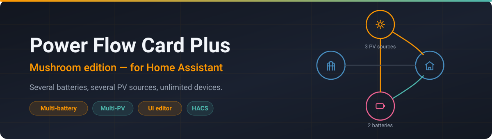
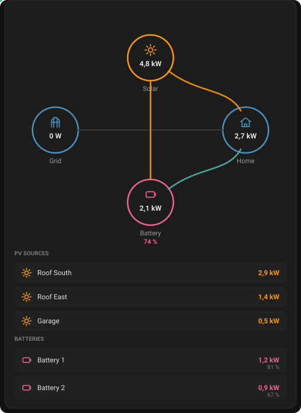
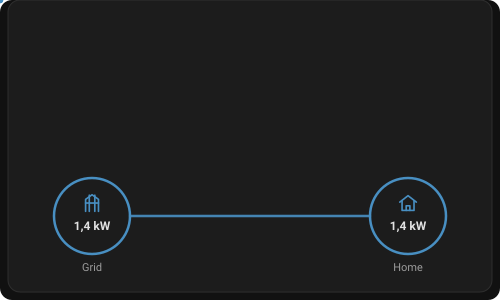
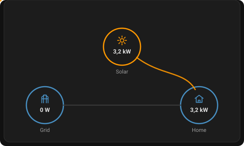
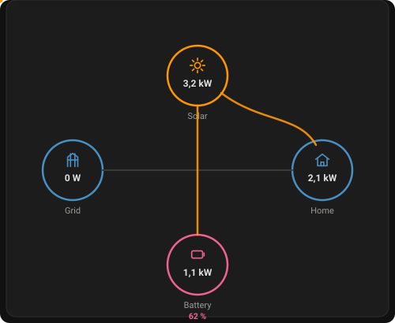
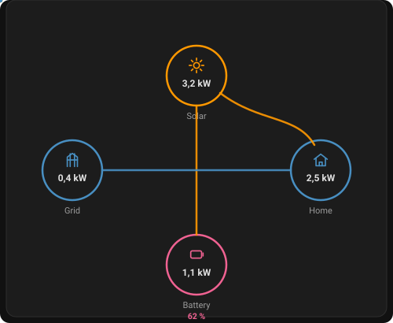
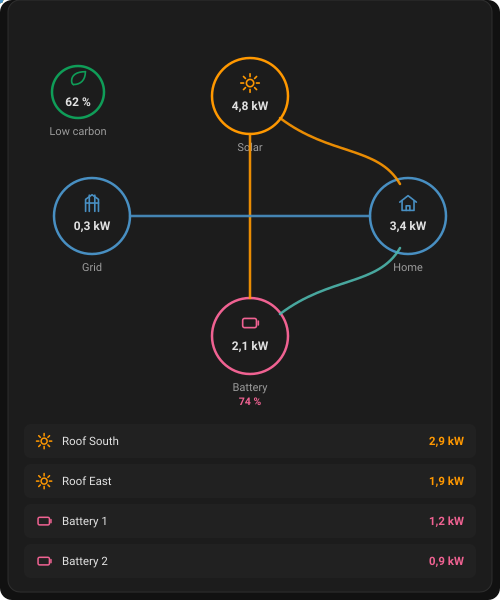
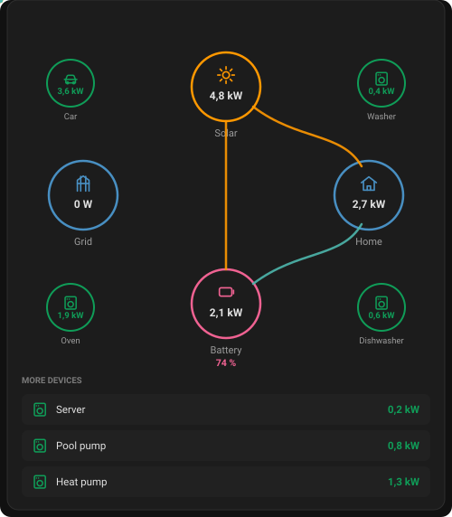
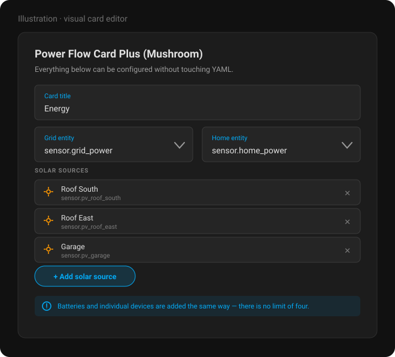

<div align="center">



# Power Flow Card Plus Mushroom

**Die Power-Flow-Karte — mit mehr als einer Batterie, mehr als einem PV-String und mehr als vier Geräten.**

[](https://hacs.xyz)
[](https://github.com/sphings79/power-flow-card-plus-mushroom/releases/latest)
[](https://github.com/sphings79/power-flow-card-plus-mushroom/releases)
[](https://github.com/sphings79/power-flow-card-plus-mushroom/commits/main)

[English](README.md) · **Deutsch**



<sub>Illustration des Kartenlayouts — kein Foto eines laufenden Dashboards.</sub>

</div>

> [!NOTE]
> **Dies ist ein Fork.** Er baut auf [flixlix/power-flow-card-plus](https://github.com/flixlix/power-flow-card-plus) von [@flixlix](https://github.com/flixlix) auf, der die ursprüngliche Karte geschrieben hat — das Verdienst daran gebührt ihm. Dieser Fork ergänzt mehrere Batterien, mehrere PV-Quellen, unbegrenzt viele Einzelgeräte und eine Optik im Mushroom-Stil.
>
> Er ist **nicht** Teil des HACS-Standardkatalogs — Installation als [benutzerdefiniertes Repository](#hacs-benutzerdefiniertes-repository). Probleme mit dem Fork bitte im [Issue-Tracker dieses Repositories](https://github.com/sphings79/power-flow-card-plus-mushroom/issues) melden, nicht im Upstream-Projekt.
>
> Wenn dir die ursprüngliche Karte nützt, unterstütze ihren Autor gern auf [ko-fi](https://ko-fi.com/flixlix).

## Zusätzliche Funktionen

- UI-Editor!!! 🥳
- Mehrsprachigkeit (🇺🇸, 🇩🇪, 🇵🇹, 🇪🇸, 🇧🇷, 🇳🇱, 🇮🇹, 🇫🇷, 🇷🇺, 🇫🇮, 🇵🇱, 🇩🇰, 🇸🇰, 🇨🇿)
- Bidirektionale Einzelgeräte ↕️
- Sekundär-Informationen für alle Kreise ℹ️
- Anzeige eines Netzausfalls ⚡️
- Template-Funktionalität 📙

<details>
<summary>… und mehr:</summary>

- Option für Karte in voller Größe
- Netz-Toleranz für kleine Werte, damit die Batterie beim Nachregeln keine Netzwerte anzeigt
- Neues, verbessertes Flussraten-Modell
- Wählbar, ob Icons, Text usw. eingefärbt werden
- Anzeige einzelner Verbraucher
- Label, Icon und Farbe je Einzelgerät anpassbar
- Konfigurierbar, ob ein Einzelgerät bei Wert 0 oder „nicht verfügbar“ ausgeblendet wird
- Klickbare Entitäten (auch das Haus)
- Korrigierte schiefe Linien
- Geschwungene Linien, die an den Kreisen andocken
- Farbe der Linie Batterie → Netz bleibt erhalten, auch ohne Einspeisung
- Anzeige emissionsarmer Energie aus dem Netz
- Label, Icon, Kreisfarbe, Icon-Farbe und Zustandstyp der emissionsarmen Energie anpassbar
- Farbe, Icon, Icon-Farbe und Label von Batterie, Solar und Haus anpassbar

</details>

## Ergänzungen dieses Forks: mehrere Batterien, mehrere PV-Quellen, unbegrenzt viele Einzelgeräte und externes Laden

> [!IMPORTANT]
> **Dieser Fork verwendet einen eigenen Kartentyp, damit er parallel zur ursprünglichen Karte laufen kann.**
> - Kartentyp im YAML: **`custom:power-flow-card-plus-mushroom`**
> - JavaScript-Ressourcendatei: **`power-flow-card-plus-mushroom.js`**
> - Name in der Kartenauswahl: **„Power Flow Card Plus (Mushroom)“**
>
> Jedes Custom Element in diesem Bundle hat einen eindeutigen Namen. Das ursprüngliche `power-flow-card-plus` und dieser Fork können also gleichzeitig installiert sein, ohne sich in die Quere zu kommen. Den Fork als eigene Dashboard-Ressource eintragen, die auf `power-flow-card-plus-mushroom.js` zeigt.

> [!NOTE]
> Die Optionen `sources`, `batteries` und `max_individual_in_grid` sind **Ergänzungen dieses Forks** (`sphings79/power-flow-card-plus-mushroom`) und nicht Teil der ursprünglichen Karte. Alles andere verhält sich genau wie im Upstream; eine bestehende Upstream-Konfiguration funktioniert weiter, sobald man ihr `type:` auf `custom:power-flow-card-plus-mushroom` umstellt.

Dieser Fork erlaubt es, die Hauptknoten **Solar** und **Batterie** aus *mehreren* Entitäten zu speisen und die Vierer-Grenze bei den **Einzelgeräten** aufzuheben. Die Hauptknoten behalten ihr gewohntes, aggregiertes Aussehen samt animierter Flüsse; jedes zugrunde liegende Gerät erscheint zusätzlich in einer kompakten, angedockten Aufschlüsselung direkt unter dem Flussdiagramm.

### Mehrere PV-Quellen (`solar.sources`)

Statt einer einzelnen `solar.entity` (oder zusätzlich dazu) lässt sich eine Liste von PV-Quellen angeben. Ihre Leistung wird zum Hauptknoten **summiert**, und jede Quelle wird unter dem Diagramm aufgeführt. Lässt man `solar.entity` weg, wird die Summe automatisch aus den Quellen berechnet.

```yaml
type: custom:power-flow-card-plus-mushroom
entities:
  solar:
    # entity: sensor.pv_total   # optional – weglassen, um die Quellen automatisch zu summieren
    sources:
      - entity: sensor.pv_roof_south
        name: Dach Süd
      - entity: sensor.pv_roof_east
        name: Dach Ost
      - entity: sensor.pv_garage
        name: Garage
```

Jede Quelle akzeptiert: `entity` (Pflicht), `name`, `icon`, `color`, `invert_state`.

### Mehrere Batterien (`battery.batteries`)

Hier lässt sich eine Liste von Batterien angeben. Ihre Leistung wird zum Hauptknoten **summiert**. Ist kein aggregierter `battery.state_of_charge` gesetzt, ist der Ladezustand des Knotens der **Mittelwert** der einzelnen Ladezustände (Prozentwerte zu summieren wäre falsch). Jede Batterie wird mit eigener Leistung und eigenem Ladezustand unter dem Diagramm aufgeführt.

```yaml
type: custom:power-flow-card-plus-mushroom
entities:
  battery:
    # entity: sensor.battery_total_power        # optional – weglassen zum Aufsummieren
    # state_of_charge: sensor.battery_total_soc # optional – weglassen für den Mittelwert
    color_circle: color_dynamically
    batteries:
      - entity: sensor.battery_1_power
        state_of_charge: sensor.battery_1_soc
        name: Batterie 1
      - entity: sensor.battery_2_power
        state_of_charge: sensor.battery_2_soc
        name: Batterie 2
```

Jede Batterie akzeptiert: `entity` (Pflicht), `state_of_charge`, `name`, `icon`, `color`, `state_of_charge_unit`, `state_of_charge_decimals`, `invert_state`.

### Mehr als 4 Einzelgeräte

Die Liste `individual` ist unbegrenzt. Die ersten vier Geräte belegen wie bisher die vier Ecken des Flussdiagramms; **weitere** Geräte werden in der angedockten Liste darunter dargestellt. Mit `max_individual_in_grid` (0–4, Standard 4) steuert man, wie viele in die Ecken wandern — der Wert `0` verschiebt *alle* Einzelgeräte in die Liste.

```yaml
type: custom:power-flow-card-plus-mushroom
max_individual_in_grid: 4   # optional, 0..4 (Standard 4)
entities:
  individual:
    - { entity: sensor.car, name: Auto }
    - { entity: sensor.washer, name: Waschmaschine }
    - { entity: sensor.dishwasher, name: Spülmaschine }
    - { entity: sensor.oven, name: Backofen }
    - { entity: sensor.server, name: Server }     # ab dem 5. -> in der Liste
    - { entity: sensor.pool, name: Poolpumpe }
```

> [!TIP]
> Alle Unter-Entitäten eines Knotens sollten dieselbe Einheit verwenden (also alle `W` oder alle `kW`); die Summe übernimmt die Einheit der ersten Entität. Die Einträge der angedockten Liste sind klickbar (More-Info), wenn `clickable_entities` aktiv ist.

### Externes Laden der Batterie (`charger`)

Manche Anlagen laden die Batterie aus einer Quelle, die weder Netz noch PV ist — ein Auto per V2L, ein Generator, Landstrom. Der Knoten `charger` macht das sichtbar: Er sitzt **unter dem Netz** und speist die Batterie über eine eigene Einwege-Flusslinie.

```yaml
type: custom:power-flow-card-plus-mushroom
entities:
  battery:
    entity: sensor.battery_power
  charger:
    name: V2L / Generator
    icon: mdi:ev-station
    sources:
      - entity: sensor.v2l_power
        name: V2L
        icon: mdi:car-electric
      - entity: sensor.generator_power
        name: Generator
        icon: mdi:engine
```

Wie bei `solar.sources` und `battery.batteries` wird die Liste `sources` zum Knoten summiert, und jeder Eintrag erscheint zusätzlich in der Aufschlüsselung unter dem Diagramm. Eine einzelne `entity` funktioniert ebenfalls, wenn man die Quellen bereits anderswo zusammenfasst.

| Option                   | Typ       | Standard          | Beschreibung                                                                     |
| ------------------------ | --------- | ----------------- | -------------------------------------------------------------------------------- |
| `sources`                | `list`    | —                 | Einzelne Ladequellen, die zum Knoten summiert werden.                            |
| `entity`                 | `string`  | —                 | Einzelne Summen-Entität. Optional, wenn `sources` gesetzt ist.                   |
| `name`                   | `string`  | `Charging source` | Beschriftung unter dem Kreis.                                                    |
| `icon`                   | `string`  | `mdi:ev-station`  | Icon im Kreis.                                                                   |
| `display_zero`           | `boolean` | `true`            | Knoten sichtbar lassen, auch wenn gerade nicht geladen wird.                     |
| `display_zero_tolerance` | `number`  | `0`               | Werte bis zu dieser Wattzahl ignorieren, um Sensorrauschen zu unterdrücken.      |
| `invert_state`           | `boolean` | `false`           | Für Quellen, die abgegebene Leistung negativ melden.                             |

> [!NOTE]
> Der Fluss ist einseitig und bewusst aus der Verteilungsrechnung von Netz/Solar/Haus herausgehalten. Die Batterie-Entität meldet die resultierende Ladung ohnehin — würde man diese Leistung zusätzlich in die Verteilung geben, wäre sie doppelt gezählt. Der Knoten braucht eine konfigurierte Batterie; allein hätte er kein Ziel.

### Das alles in der UI konfigurieren

Die obigen Listen (`solar.sources`, `battery.batteries`, `charger.sources`) waren früher nur per YAML zu setzen. Inzwischen haben sie eigene Felder im visuellen Editor: Auf der Seite Solar, Batterie oder Ladequelle fügt **Hinzufügen** einen Eintrag an, dazu gibt es Bedienelemente zum Umsortieren und Entfernen. Wer den Rest einer Seite bearbeitet, verliert eine per YAML angelegte Liste nicht mehr.

### Einzelgeräte als Liste (`individual_position`)

Ab einer Handvoll Einzelgeräte bringen die vier Ecken nichts mehr. Mit `individual_position: right` verlieren sie ihre Kreise vollständig und erscheinen stattdessen als Liste neben dem Diagramm — im selben Stil wie die Batterie-Aufschlüsselung darunter.

```yaml
type: custom:power-flow-card-plus-mushroom
individual_position: right          # grid (Standard) | right
sort_individual_devices: name_desc  # value (Standard) | name | name_desc
entities:
  individual:
    - entity: sensor.washing_machine
      name: Waschmaschine
      icon: mdi:washing-machine
```

`sort_individual_devices` akzeptiert weiterhin das historische `true`, was `value` entspricht — höchster Verbrauch zuerst. Auf schmalen Karten rutscht die Liste unter das Diagramm, statt es zusammenzuquetschen.

Geräte lassen sich zusätzlich nach aktuellem Verbrauch einfärben — grün bei wenig, orange in der Mitte, rot am oberen Ende der Skala:

```yaml
color_individual_by_usage: true
individual_color_max: 3000   # Watt für volles Rot; Standard ist max_expected_power
```

Die Batterien in der Aufschlüsselung lassen sich nach Ladezustand einfärben — grün bei voll, orange um die Hälfte, rot bei leer:

```yaml
color_battery_by_soc: true
```

Der Leistungswert einer Batterie kann danach eingefärbt werden, wie stark sie entlädt — grün bei kaum, rot bei Volllast. Jede Batterie wird an ihrem eigenen Maximum gemessen:

```yaml
color_battery_by_discharge: true
battery_discharge_max: 8000        # Rückfallwert für Batterien ohne eigenen Wert
entities:
  battery:
    batteries:
      - entity: sensor.battery_a_power
        discharge_color_max: 8000
      - entity: sensor.battery_b_power
        discharge_color_max: 2500
```

Entladen wird als **negativer** Wert gelesen, genau wie die Zeile ihn anzeigt; Laden zählt nicht als Entladen und bleibt grün. Die beiden Schalter sind unabhängig: `color_battery_by_soc` färbt Icon und Akzentbalken, `color_battery_by_discharge` den Leistungswert.

Eine an der Batterie selbst gesetzte Farbe schlägt immer beide Einfärbungen.

Die angedockte Aufschlüsselung unter dem Diagramm ordnet ihre Einträge zu zweit pro Zeile an — vier Batterien ergeben also einen 2×2-Block statt einer hohen Spalte.

### Energiemodus (`kWh`)

Die Karte kann Energie statt Leistung anzeigen. Ein Schalter in der Kopfzeile wechselt zwischen beidem; Batterien und Einzelgeräte zeigen ihre Energie in den Listen dauerhaft — dort ist Platz dafür.

```yaml
type: custom:power-flow-card-plus-mushroom
energy_period: today   # yesterday | week | month | year | last_7_days | last_30_days | last_365_days
energy_toggle: true    # W/kWh-Schalter anzeigen (Standard: true, sobald Energie konfiguriert ist)
energy_default: false  # im kWh-Modus starten
entities:
  grid:
    entity: sensor.grid_power
    energy_consumed_entity: sensor.grid_import          # kumulative kWh
    energy_returned_entity: sensor.grid_export
  solar:
    entity: sensor.solar_power
    energy_entity: sensor.solar_production
  battery:
    entity: sensor.battery_power
    energy_charged_entity: sensor.battery_charged_total
    energy_discharged_entity: sensor.battery_discharged_total
    batteries:
      - entity: sensor.battery_a_power
        energy_charged_entity: sensor.battery_a_charged_total
        energy_discharged_entity: sensor.battery_a_discharged_total
  individual:
    - entity: sensor.washing_machine_power
      energy_entity: sensor.washing_machine_energy
```

**Hier gehören kumulative kWh-Sensoren hin**, keine Tageswerte. Die Karte fragt die Statistik von Home Assistant nach der Differenz über den gewählten Zeitraum — ein einziger Gesamtzähler bedient damit jeden Zeitraum. Entspricht ein Sensor bereits exakt dem gewünschten Zeitraum, setzt man daneben `energy_from_state: true`, und die Karte liest seinen Zustand unverändert.

Die Zeiträume sind kalenderbasiert — `week` beginnt am Montag, `month` am Ersten, `year` am 1. Januar, jeweils bis jetzt. Die `last_*`-Varianten sind gleitende Fenster über ganze Tage rückwärts ab heute, heute eingeschlossen.

In den Listen zeigen die Batterien beide Richtungen: Pfeil nach unten für geladene, Pfeil nach oben für entladene Energie.

Für jede dieser Entitäten gibt es ein Feld im visuellen Editor: Jede Knotenseite (Netz, Solar, Haus, Batterie, Ladequelle) hat einen Abschnitt **Energie**, ebenso jeder Eintrag in der Batterie-, PV-Quellen- und Ladequellen-Liste sowie jedes Einzelgerät.

Große Summen wechseln zu MWh, damit sie das Layout nicht sprengen:

```yaml
kwh_threshold: 1000   # kWh, ab denen MWh übernimmt; 0 schaltet den Wechsel ab
mwh_decimals: 2
```

### Wohin die Listen wandern (`*_position`)

Jede Aufschlüsselungsliste lässt sich in einer beliebigen Zone rund um das Diagramm parken, damit sich das Layout nach der Anlage richtet und nicht umgekehrt:

```yaml
solar_position: top        # top (Standard) | bottom | left | right
battery_position: bottom   # top | bottom (Standard) | left | right
charger_position: bottom   # top | bottom (Standard) | left | right
individual_position: right # grid (Standard, Kreise) | top | bottom | left | right
```

Seitliche Zonen stapeln einen Eintrag pro Zeile; oben und unten passen zwei pro Zeile, wo die Breite reicht. `individual_position: grid` ist der einzige Wert, der die Geräte als Kreise im Diagramm belässt — jeder andere Wert stellt sie als Liste dar.

### PV-Quellen nach Ertrag einfärben (`color_solar_by_output`)

```yaml
color_solar_by_output: true
solar_color_max: 10000        # Rückfallwert für Quellen ohne eigene Spitzenleistung
entities:
  solar:
    sources:
      - entity: sensor.roof_power
        name: Dach 10 kWp
        color_max: 10000       # Spitzenleistung dieses Strings in Watt
        energy_entity: sensor.roof_energy
      - entity: sensor.balcony_power
        name: Balkon 800 Wp
        color_max: 800
        energy_entity: sensor.balcony_energy
```

Rot bei Stillstand, orange dazwischen, grün bei Spitzenleistung — spiegelbildlich zur Verbrauchs-Einfärbung. **Jeder String wird an seinem eigenen `color_max` gemessen**, ein Balkonmodul mit 800 Wp erscheint bei Volllast also genauso grün wie ein 10-kWp-Dach. Ohne `color_max` fällt eine Quelle auf `solar_color_max` zurück und danach auf `max_expected_power`. Der Leistungswert wird zusammen mit Icon und Akzentbalken eingefärbt.

Bei null Ertrag wird die Zeile **grau** statt rot: Nachts nichts zu produzieren ist kein Fehler, und Rot bleibt einem String vorbehalten, der produzieren könnte, es aber kaum tut.

PV-Quellen und Ladequellen nehmen ebenfalls `energy_entity`, damit ihre kWh in der Liste neben Batterien und Einzelgeräten erscheinen.

### Mushroom-Optik

`appearance: mushroom` stellt die Karte optisch so um, dass sie neben [Mushroom](https://github.com/piitaya/lovelace-mushroom)-Karten stimmig wirkt. Das ist ein reiner Stilschalter — keine Änderung an Entitäten, Layout oder Verhalten —, man kann also jederzeit zwischen beiden Looks wechseln.

```yaml
type: custom:power-flow-card-plus-mushroom
appearance: mushroom   # classic (Standard) | mushroom
entities:
  grid:
    entity: sensor.grid_power
```

Was sich gegenüber `classic` ändert:

- **Flächen statt Ringe** — die Kreise verlieren ihre 2px-Kontur und werden mit ihrer eigenen Farbe bei 20 % Deckkraft gefüllt, das Icon in voller Farbe. Genau so behandelt Mushroom seine Icon-Flächen.
- **Typografie** — Werte und Beschriftungen übernehmen Mushrooms Schriftstärken und -größen; Sekundär-Informationen werden gedimmt statt in vollem Kontrast gezeichnet.
- **Weichere Flusslinien** — etwas dicker mit runden Enden, damit sie als Striche und nicht als Haarlinien wirken.
- **Aufschlüsselung als Chips** — aus der angedockten Liste von PV-Quellen, Batterien und zusätzlichen Einzelgeräten wird eine Reihe getönter Chips mit eigenen Icon-Flächen statt der Listendarstellung mit linkem Rand.

#### Feinabstimmung

Drei CSS-Custom-Properties stehen zur Verfügung, pro Karte über `style_card_content` oder global im Theme setzbar:

| Property                | Standard                              | Beschreibung                                                        |
| ----------------------- | ------------------------------------- | ------------------------------------------------------------------- |
| `--pfcp-shape-strength` | `20%`                                 | Deckkraft der Flächenfüllung. Niedriger ist dezenter, höher kräftiger. |
| `--pfcp-shape-radius`   | `var(--mush-icon-border-radius, 50%)` | Eckenradius der Flächen. Folgt dem Mushroom-Theme, wenn es einen setzt. |
| `--pfcp-shape-fallback` | `var(--primary-color)`                | Füllfarbe für Knoten ohne eigene Farbe.                             |

Für eckige Flächen, passend zu einem Mushroom-Theme mit eckigen Icons:

```yaml
appearance: mushroom
style_card_content: "--pfcp-shape-radius: 12px;"
```

> [!NOTE]
> Die Flächenfüllung nutzt die CSS-Funktion `color-mix()`. Jeder Browser, den Home Assistant derzeit unterstützt, beherrscht sie; auf einem älteren Browser werden die Flächen schlicht transparent gezeichnet, statt das Layout zu zerlegen.

## Ziel

Ziel dieser Karte ist es, die aktuelle Leistungsverteilung von und zu verschiedenen Quellen — Solar, Netz, Hausbatterien und so weiter — leicht verständlich und anschaulich darzustellen. Darüber hinaus will sie sehr viel Anpassbarkeit und Kontrolle über ihr Verhalten in die Konfiguration legen, damit man sie auf die eigenen Anforderungen zuschneiden kann.

## Abgrenzung

Diese Karte will **keine** Energiewerte darstellen (also über einen Tag aufsummierte Leistung). Wer das sucht, schaue sich die [Energy Flow Card Plus](https://github.com/flixlix/energy-flow-card-plus) an.

## Anleitungen

Wer lieber ein Video schaut, statt diese sehr lange README zu lesen 😅, dem seien folgende Videos empfohlen.

> [!NOTE]
> Diese Videos behandeln die **ursprüngliche** Karte. Als Einführung in die gemeinsamen Optionen taugen sie weiterhin, die Ergänzungen dieses Forks (mehrere Batterien, mehrere PV-Quellen, unbegrenzt viele Einzelgeräte, Mushroom-Optik) zeigen sie aber nicht.

- [Power Flow Card Plus in Home Assistant – Jetzt noch besser? Anleitung von Smartzeug](https://youtu.be/PUOU5qdhMro) – _auf Deutsch_, aktuell bis Version 0.2.2
- [Power Flow Card Plus for Home Assistant von Speak to the Geek](https://youtu.be/C4Zh35E9wJE?si=REuWZxmfF91G0Ht7) – _Änderungen an der Einzelgeräte-Konfiguration_

## Installation

### HACS (benutzerdefiniertes Repository)

[](https://my.home-assistant.io/redirect/hacs_repository/?owner=sphings79&repository=power-flow-card-plus-mushroom&category=Dashboard)

Dieser Fork steckt **nicht** im HACS-Standardkatalog, die Suche findet ihn also nicht. Er muss zuerst als benutzerdefiniertes Repository hinzugefügt werden. Zur Installation von HACS selbst siehe diese [Anleitung](https://hacs.xyz/docs/setup/prerequisites).

1. In Home Assistant **HACS** öffnen.
2. Das Drei-Punkte-Menü (oben rechts) öffnen und **Benutzerdefinierte Repositories** wählen.
3. Repository: `https://github.com/sphings79/power-flow-card-plus-mushroom` — Kategorie: **Dashboard**.
4. Hinzufügen, dann in HACS nach **Power Flow Card Plus Mushroom** suchen und herunterladen.

Der Button oben erledigt die Schritte 1–3.

<details>
<summary>Manuelle Installation</summary>

1. `power-flow-card-plus-mushroom.js` aus dem [neuesten Release](https://github.com/sphings79/power-flow-card-plus-mushroom/releases/latest) herunterladen und in das Verzeichnis `config/www` kopieren.

2. Die Ressource wie unten beschrieben eintragen.

### Ressource eintragen

Wer Dashboards per YAML konfiguriert, trägt in der `configuration.yaml` einen Verweis auf `power-flow-card-plus-mushroom.js` ein:

```yaml
resources:
  - url: /local/power-flow-card-plus-mushroom.js
    type: module
```

Wer den grafischen Editor bevorzugt, nimmt das Menü:

1. Sicherstellen, dass im Benutzerprofil der erweiterte Modus aktiv ist (über den eigenen Benutzernamen erreichbar)
2. Zu Einstellungen → Dashboards wechseln
3. Auf das Drei-Punkte-Symbol klicken
4. **Ressourcen** wählen
5. Auf (+ RESSOURCE HINZUFÜGEN) klicken
6. Als URL `/local/power-flow-card-plus-mushroom.js` eintragen und als Typ „JavaScript-Modul“ wählen.
   (Bei einer HACS-Installation stattdessen `/hacsfiles/power-flow-card-plus-mushroom/power-flow-card-plus-mushroom.js` mit „JavaScript-Modul“ verwenden, falls HACS das nicht schon erledigt hat.)

</details>

## Verwendung

> [!WARNING]
> Diese Karte bietet **sehr viele** Konfigurationsoptionen. Keine Sorge: Wer nur das Aussehen der offiziellen Energy-Flow-Karte nachbauen möchte, muss lediglich die Entitäten einrichten. Alles Weitere dient der zusätzlichen Anpassung. Für diesen Fall geht es direkt zur [Minimalkonfiguration](#minimalkonfiguration).

### Optionen

#### Karten-Optionen

| Name                        | Typ       |                 Standard                 | Beschreibung                                                                                                                                      |
| --------------------------- | --------- | :--------------------------------------: | ------------------------------------------------------------------------------------------------------------------------------------------------- |
| type                        | `string`  |            **erforderlich**              | `custom:power-flow-card-plus-mushroom`.                                                                                                            |
| entities                    | `object`  |            **erforderlich**              | Eine oder mehrere Sensor-Entitäten, siehe [Entities-Objekt](#entities-objekt) für weitere Optionen.                                                |
| title                       | `string`  |                                          | Zeigt einen Titel am oberen Rand der Karte.                                                                                                        |
| dashboard_link              | `string`  |                                          | Zeigt einen Link zu einem Energie-Dashboard. Erwartet einen URL-Pfad, für das eingebaute Dashboard also z. B. `/energy`.                           |
| dashboard_link_label        | `string`  | Zum Energie-Dashboard (wird übersetzt)   | Überschreibt die Standardbeschriftung des Links.                                                                                                   |
| second_dashboard_link       | `string`  |                                          | Zeigt einen zweiten Link zu einem Energie-Dashboard, ebenfalls als URL-Pfad (nur im YAML-Editor verfügbar).                                        |
| second_dashboard_link_label | `string`  | Zum Energie-Dashboard (wird übersetzt)   | Überschreibt die Standardbeschriftung des zweiten Links.                                                                                           |
| kw_decimals                 | `number`  |                    1                     | Nachkommastellen bei der Anzeige in Kilowatt.                                                                                                      |
| w_decimals                  | `number`  |                    1                     | Nachkommastellen bei der Anzeige in Watt.                                                                                                          |
| min_flow_rate               | `number`  |                   .75                    | Zeit in Sekunden, die der schnellste Punkt von einem Ende zum anderen braucht.                                                                     |
| max_flow_rate               | `number`  |                    6                     | Zeit in Sekunden, die der langsamste Punkt von einem Ende zum anderen braucht.                                                                     |
| watt_threshold              | `number`  |                    0                     | Wattzahl, ab der auf Kilowatt umgestellt wird. `0` zeigt immer Kilowatt.                                                                            |
| clickable_entities          | `boolean` |                  false                   | Bei `true` öffnet ein Klick auf die Entität deren More-Info-Dialog.                                                                                 |
| min_expected_power          | `number`  |                   0.01                   | Minimale erwartete Leistung (in Watt), die zu einem Zeitpunkt durch das System fließt. Nur für die [neue Flussformel](#neue-flussformel).           |
| max_expected_power          | `number`  |                   2000                   | Maximale erwartete Leistung (in Watt), die zu einem Zeitpunkt durch das System fließt. Nur für die [neue Flussformel](#neue-flussformel).           |
| display_zero_lines          | `object`  |             `{mode: "show"}`             | Siehe [Null-Linien anzeigen](#null-linien-anzeigen).                                                                                               |
| full_size                   | `boolean` |                  false                   | Achtung: experimentell. Erfordert eine Ansicht im Panel-Modus. Bei `true` nimmt die Karte die volle Bildschirmhöhe ein und rückt in die Mitte.      |
| style_ha_card               | `css`     |                                          | [CSS](https://developer.mozilla.org/de/docs/Web/CSS) für den Kartenrahmen (Rand und Hintergrund der Karte).                                        |
| style_card_content          | `css`     |                                          | [CSS](https://developer.mozilla.org/de/docs/Web/CSS) für den Karteninhalt (alle Kreise und Linien).                                                |
| use_new_flow_rate_model     | `boolean` |                  false                   | Bei `true` nutzt die Karte die [neue Flussformel](#neue-flussformel).                                                                              |
| sort_individual_devices     | `boolean` |            true (seit v0.3.1)            | Bei `true` werden Geräte nach Verbrauch → Entity-ID → alphabetisch sortiert.                                                                       |
| allow_layout_break          | `boolean` |                  false                   | Erlaubt immer bis zu 4 Einzelgeräte, auch wenn der Platz nicht reicht — das Layout bricht dann sichtbar um.                                        |
| appearance                  | `string`  |                `classic`                 | `classic` behält die ursprüngliche Optik mit umrandeten Kreisen. `mushroom` passt die Karte an [Mushroom](https://github.com/piitaya/lovelace-mushroom) an — siehe [Mushroom-Optik](#mushroom-optik). |

#### Aktionen

Die Karte unterstützt Home-Assistant-Aktionen auf Entitätskreisen und anderen klickbaren Flächen.

| Name              | Typ      | Beschreibung                          |
| ----------------- | -------- | ------------------------------------- |
| tap_action        | `object` | Aktion bei Tippen/Klicken.            |
| hold_action       | `object` | Aktion bei langem Drücken.            |
| double_tap_action | `object` | Aktion bei Doppeltippen/Doppelklick.  |

Ist für eine klickbare Fläche keine dieser Aktionen konfiguriert, fällt die Karte bei `clickable_entities: true` auf den More-Info-Dialog zurück.

#### Entities-Objekt

Mindestens eines von _grid_, _battery_ oder _solar_ ist erforderlich. Alle Entitäten (außer _battery_charge_) sollten ein `unit_of_measurement` von W (Watt) oder kW (Kilowatt) haben.

| Name                   | Typ      | Beschreibung                                                       |
| ---------------------- | :------- | ------------------------------------------------------------------ |
| grid                   | `object` | Siehe [Netz-Konfiguration](#netz-konfiguration).                    |
| solar                  | `object` | Siehe [Solar-Konfiguration](#solar-konfiguration).                  |
| battery                | `object` | Siehe [Batterie-Konfiguration](#batterie-konfiguration).            |
| individual             | `array`  | Siehe [Einzelgeräte](#einzelgeräte-konfiguration).                  |
| home                   | `object` | Siehe [Haus-Konfiguration](#haus-konfiguration).                    |
| fossil_fuel_percentage | `object` | Siehe [Fossil-Anteil](#fossil-anteil-konfiguration).                |

#### Netz-Konfiguration

| Name                   | Typ                                                              | Standard                    | Beschreibung                                                                                                                                                                                                     |
| ---------------------- | ---------------------------------------------------------------- | --------------------------- | ------------------------------------------------------------------------------------------------------------------------------------------------------------------------------------------------------------- |
| entity                 | `string` oder `object`                                           | `undefined`, erforderlich   | Entity-ID eines Sensors mit einem einzelnen Zustand — negative Werte für Erzeugung, positive für Verbrauch — oder ein Objekt für [getrennte Entitäten](#getrennte-entitäten). Beispiele für beides weiter unten.  |
| name                   | `string`                                                         | `Grid`                      | Ohne eigene Angabe folgt die Beschriftung weiterhin der gewählten Sprache.                                                                                                                                       |
| icon                   | `string`                                                         | `mdi:transmission-tower`    | Icon im Netz-Kreis.                                                                                                                                                                                              |
| color                  | `object`                                                         |                             | Siehe [Farb-Objekt](#farb-objekt).                                                                                                                                                                               |
| color_icon             | `color_dynamically`, `no_color`, `production` oder `consumption` | `no_color`                  | Bei `color_dynamically` folgt die Icon-Farbe dem höchsten Wert. Bei `production` der Erzeugung, bei `consumption` dem Verbrauch.                                                                                 |
| display_state          | `two_way`, `one_way` oder `one_way_no_zero`                      | `two_way`                   | Bei `two_way` wird die Erzeugung immer gleichzeitig gezeigt. Bei `one_way` nur die gerade aktive Richtung (da die Karte nur Momentanleistung zeigt, gibt es keine Überschneidungen ✅). `one_way_no_zero` verhält sich wie `one_way`, zeigt aber weiterhin die Verbrauchsrichtung, wenn alle Zustände `0` sind. |
| color_circle           | `color_dynamically`, `production` oder `consumption`             | `consumption`               | Bei `color_dynamically` wechselt die Farbe des Netz-Kreises je nachdem, ob bezogen oder eingespeist wird. Bei `production` folgt sie der Erzeugung, bei `consumption` dem Verbrauch.                             |
| secondary_info         | `object`                                                         | `undefined`                 | Siehe [Sekundär-Info](#sekundär-info-konfiguration).                                                                                                                                                             |
| display_zero_tolerance | `number`                                                         | `0`                         | Zustände unterhalb dieser Zahl gelten als null. Verhindert, dass der Netz-Kreis einen kleinen Verbrauch zeigt, während die Batterie gegen das Netz nachregelt.                                                    |
| power_outage           | `object`                                                         | `undefined`                 | Verhalten bei Netzausfall, siehe [Netzausfall](#netzausfall).                                                                                                                                                     |
| color_value            | `boolean`                                                        | `true`                      | Bei `false` werden die Leistungswerte nicht nach Ein- und Ausspeisung eingefärbt.                                                                                                                                |
| invert_state           | `boolean`                                                        | `false`                     | Bei `true` werden Richtung und Werte invertiert: Ein positiver Wert gilt dann als Erzeugung, ein negativer als Verbrauch.                                                                                        |

#### Solar-Konfiguration

| Name               | Typ       | Standard                  | Beschreibung                                                                                                                       |
| ------------------ | --------- | ------------------------- | ---------------------------------------------------------------------------------------------------------------------------------- |
| entity             | `string`  | `undefined`, erforderlich | Entity-ID mit dem Wert der Solarerzeugung.                                                                                          |
| name               | `string`  | `Solar`                   | Beschriftung der Solar-Option. Ohne eigene Angabe folgt sie weiterhin der gewählten Sprache.                                        |
| icon               | `string`  | `mdi:solar-power`         | Icon im Solar-Kreis.                                                                                                                |
| color              | `string`  |                           | HEX-Wert für Kreise, Beschriftungen und Linien der Solarerzeugung.                                                                  |
| color_icon         | `boolean` | `false`                   | Bei `true` folgt die Icon-Farbe der Kreisfarbe, bei `false` der Textfarbe.                                                          |
| color_value        | `boolean` | `false`                   | Bei `true` folgt die Textfarbe des Zustands der Kreisfarbe, bei `false` der primären Textfarbe.                                     |
| secondary_info     | `object`  | `undefined`               | Siehe [Sekundär-Info](#sekundär-info-konfiguration).                                                                                |
| display_zero       | `boolean` | `true`                    | Bei `true` wird das Gerät auch dann gezeigt, wenn der Zustand `0` oder keine Zahl ist (z. B. `unavailable`). Sonst wird der Solar-Kreis ausgeblendet. |
| display_zero_state | `boolean` | `true`                    | Bei `true` wird der Zustand auch bei `0` angezeigt, bei `false` ausgeblendet.                                                       |
| invert_state       | `boolean` | `false`                   | Bei `true` werden Richtung und Werte invertiert: Ein negativer Wert gilt dann als Erzeugung, ein positiver wird als 0 gezeigt.      |

#### Batterie-Konfiguration

| Name                             | Typ                                                              | Standard                                        | Beschreibung                                                                                                                                                     |
| -------------------------------- | ---------------------------------------------------------------- | ----------------------------------------------- | ---------------------------------------------------------------------------------------------------------------------------------------------------------------- |
| entity                           | `string` oder `object`                                           | `undefined`, erforderlich                       | Entity-ID eines Sensors mit einem einzelnen Zustand — negative Werte für Erzeugung, positive für Verbrauch — oder ein Objekt für [getrennte Entitäten](#getrennte-entitäten). |
| state_of_charge                  | `string`                                                         | `undefined`, erforderlich                       | Entity-ID mit dem Ladezustand der Batterie in Prozent (`100` bei voller Batterie).                                                                                |
| state_of_charge_unit             | `string`                                                         | `%`                                             | Einheit des Ladezustands.                                                                                                                                         |
| state_of_charge_unit_white_space | `boolean`                                                        | `true`                                          | Bei `false` steht kein Leerzeichen vor der Einheit des Ladezustands.                                                                                              |
| state_of_charge_decimals         | `number`                                                         | `0`                                             | Nachkommastellen des Ladezustands.                                                                                                                                |
| name                             | `string`                                                         | `Battery`                                       | Beschriftung der Batterie-Option. Ohne eigene Angabe folgt sie weiterhin der gewählten Sprache.                                                                   |
| icon                             | `string`                                                         | `mdi:battery` oder dynamisch nach Ladezustand   | Icon im Batterie-Kreis.                                                                                                                                           |
| color                            | `object`                                                         |                                                 | Siehe [Farb-Objekt](#farb-objekt).                                                                                                                                |
| color_icon                       | `color_dynamically`, `no_color`, `production` oder `consumption` | `no_color`                                      | Bei `color_dynamically` folgt die Icon-Farbe dem höchsten Wert. Bei `production` der Erzeugung, bei `consumption` dem Verbrauch.                                  |
| display_state                    | `two_way`, `one_way` oder `one_way_no_zero`                      | `two_way`                                       | Wie bei der Netz-Konfiguration.                                                                                                                                   |
| color_state_of_charge_value      | `color_dynamically`, `no_color`, `production` oder `consumption` | `no_color`                                      | Bei `color_dynamically` folgt die Textfarbe des Ladezustands dem höchsten Wert, bei `production` der Erzeugung, bei `consumption` dem Verbrauch.                  |
| color_circle                     | `color_dynamically`, `production` oder `consumption`             | `consumption`                                   | Bei `color_dynamically` folgt die Kreisfarbe dem höchsten Wert, bei `production` der Erzeugung, bei `consumption` dem Verbrauch.                                  |
| color_value                      | `boolean`                                                        | `true`                                          | Bei `false` werden die Leistungswerte nicht nach Ein- und Ausspeisung eingefärbt.                                                                                 |
| invert_state                     | `boolean`                                                        | `false`                                         | Bei `true` werden Richtung und Werte invertiert: Ein positiver Wert gilt dann als Erzeugung, ein negativer als Verbrauch.                                         |

#### Einzelgeräte-Konfiguration

Das Feld `individual` muss ein Array von Objekten sein. Jedes Objekt hat folgenden Aufbau:

| Name                   | Typ       | Standard                                       | Beschreibung                                                                                                                            |
| ---------------------- | --------- | ---------------------------------------------- | --------------------------------------------------------------------------------------------------------------------------------------- |
| entity                 | `string`  | `undefined`, erforderlich                      | Entity-ID mit dem Wert eines einzelnen Verbrauchs.                                                                                       |
| name                   | `string`  | `Car` bzw. `Motorcycle`                        | Beschriftung des Einzelgeräts. Ohne eigene Angabe folgt sie weiterhin der gewählten Sprache.                                             |
| icon                   | `string`  | `mdi:car-electric` bzw. `mdi:motorbike-electric` | Icon im Kreis des Einzelgeräts.                                                                                                        |
| color                  | `string`  | `#d0cc5b` bzw. `#964cb5`                       | HEX-Wert für Kreis, Beschriftung und Linien des Einzelgeräts.                                                                            |
| color_icon             | `boolean` | `false`                                        | Bei `true` folgt die Icon-Farbe der Kreisfarbe, bei `false` der Textfarbe.                                                               |
| unit_of_measurement    | `string`  | `W` bzw. `kW` (dynamisch)                      | Legt die im jeweiligen Kreis angezeigte Einheit fest.                                                                                    |
| inverted_animation     | `boolean` | `false`                                        | Bei `true` laufen die kleinen Punkte in die entgegengesetzte Richtung.                                                                   |
| secondary_info         | `object`  | `undefined`                                    | Siehe [Sekundär-Info](#sekundär-info-konfiguration). Die Entität darf eine Zahl oder eine Zeichenkette liefern (z. B. `charging`).       |
| display_zero           | `boolean` | `false`                                        | Bei `true` wird das Gerät auch bei Zustand `0` oder „keine Zahl“ (z. B. `unavailable`) angezeigt.                                        |
| display_zero_tolerance | `number`  | `0`                                            | Wenn gesetzt, wird das Gerät angezeigt, sobald der Zustand über der Toleranz liegt. `display_zero` muss dafür nicht auf `true` stehen.   |
| display_zero_state     | `boolean` | `true`                                         | Bei `true` wird der Zustand auch bei `0` angezeigt, bei `false` ausgeblendet.                                                            |
| color_value            | `boolean` | `false`                                        | Bei `true` folgt die Textfarbe des Zustands der Kreisfarbe, bei `false` der primären Textfarbe.                                          |
| decimals               | `number`  | `0`                                            | Nachkommastellen im jeweiligen Zustand.                                                                                                  |

#### Haus-Konfiguration

| Name                | Typ                                             | Standard                  | Beschreibung                                                                                                                                                    |
| ------------------- | ----------------------------------------------- | ------------------------- | --------------------------------------------------------------------------------------------------------------------------------------------------------------- |
| entity              | `string`                                        | `undefined`, erforderlich | Entity-ID mit dem Hausverbrauch. Diese Entität wird nicht angezeigt und dient nur dem More-Info-Dialog beim Klick auf den Haus-Bereich.                          |
| name                | `string`                                        | `Home`                    | Beschriftung der Haus-Option. Ohne eigene Angabe folgt sie weiterhin der gewählten Sprache.                                                                      |
| icon                | `string`                                        | `mdi:home`                | Icon im Haus-Kreis.                                                                                                                                              |
| color_icon          | `boolean`, `solar`, `grid` oder `battery`       | `false`                   | Bei `true` folgt die Icon-Farbe dem höchsten Wert; bei `solar`, `grid` bzw. `battery` der Farbe von Solar, Netzbezug bzw. Batterieentladung.                     |
| color_value         | `boolean`, `solar`, `grid` oder `battery`       | `false`                   | Bei `true` folgt die Textfarbe dem höchsten Wert; bei `solar`, `grid` bzw. `battery` der Farbe von Solar, Netzbezug bzw. Batterieentladung.                      |
| secondary_info      | `object`                                        | `undefined`               | Siehe [Sekundär-Info](#sekundär-info-konfiguration).                                                                                                             |
| subtract_individual | `boolean`                                       | `false`                   | Bei `true` wird der Hausverbrauch berechnet, indem die Summe der Einzelgeräte davon abgezogen wird.                                                              |
| override_state      | `boolean`                                       | `false`                   | Bei `true` ist der Hausverbrauch der Zustand der angegebenen Entität. Standardmäßig wird er aus allen Quellen aufaddiert. Nützlich z. B. bei Wechselrichterverlusten. |

#### Fossil-Anteil-Konfiguration

| Name                | Typ                    | Standard              | Beschreibung                                                                                                                                                                                                                       |
| ------------------- | ---------------------- | --------------------- | ---------------------------------------------------------------------------------------------------------------------------------------------------------------------------------------------------------------------------------- |
| entity              | `string`               | `none`, erforderlich  | Entity-ID mit dem prozentualen Anteil fossiler Energie. `100` bedeutet, dass der gesamte Netzstrom aus emissionsstarken Quellen stammt, `0` das Gegenteil. Empfohlen ist die CO2-Signal-Integration, die diesen Sensor ohne Templating liefert. Diese Entität wird auch im More-Info-Dialog verwendet. |
| name                | `string`               | Low-carbon            | Beschriftung über dem Kreis.                                                                                                                                                                                                        |
| icon                | `string`               | `mdi:leaf`            | Icon im Kreis (z. B. `mdi:home`).                                                                                                                                                                                                   |
| color               | `string`               | `#0f9d58`             | HEX-Wert für die Kontur des Kreises und die Linie zum Netz.                                                                                                                                                                          |
| color_icon          | `boolean`              | `false`               | Bei `true` wird das Icon in der Farbe aus `color` gezeichnet, sonst wie alle anderen Icons.                                                                                                                                          |
| display_zero        | `boolean`              | `true`                | Bei `true` wird der Bereich auch bei Zustand `0` oder „keine Zahl“ angezeigt, sonst ausgeblendet.                                                                                                                                    |
| display_zero_state  | `boolean`              | `true`                | Bei `true` wird der Zustand auch bei `0` angezeigt, bei `false` ausgeblendet.                                                                                                                                                        |
| state_type          | `string`               | `power`               | Art des Zustands: `power` zeigt die emissionsarme Leistung aus dem Netz, `percentage` deren prozentualen Anteil.                                                                                                                     |
| unit_white_space    | `boolean`              | `true`                | Bei `false` steht kein Leerzeichen zwischen Zustand und Einheit.                                                                                                                                                                     |
| calculate_flow_rate | `boolean` oder `number` | `false`              | Bei `true` wird die Flussrate über die Flussformel berechnet (je nach Konfiguration die alte oder die neue). Als Zahl wird die Flussrate fest gesetzt: `10` bedeutet, dass alle 10 Sekunden ein Punkt läuft.                          |

#### Farb-Objekt

| Name        | Typ      | Beschreibung                                                          |
| ----------- | -------- | --------------------------------------------------------------------- |
| production  | `string` | HEX-Wert für Kreise, Beschriftungen und Linien der Erzeugung.         |
| consumption | `string` | HEX-Wert für Kreise, Beschriftungen und Linien des Verbrauchs.        |

#### Getrennte Entitäten

Verwendbar bei der Netz- oder Batterie-Konfiguration. Es gilt dieselbe Regel für `unit_of_measurement` wie oben.

| Name        | Typ      | Beschreibung                                                                                       |
| ----------- | -------- | -------------------------------------------------------------------------------------------------- |
| consumption | `string` | Entity-ID mit dem Verbrauchswert. Bei einem getrennten Netz-Objekt erforderlich.                    |
| production  | `string` | Entity-ID mit dem Erzeugungswert.                                                                   |

#### Sekundär-Info-Konfiguration

Damit lässt sich für jedes Einzelgerät ein zusätzlicher kleiner Text konfigurieren — zum Beispiel der Ladezustand eines Elektroautos.

| Name                   | Typ                  | Beschreibung                                                                                                                                                                                                                             |
| ---------------------- | -------------------- | ----------------------------------------------------------------------------------------------------------------------------------------------------------------------------------------------------------------------------------------- |
| entity                 | `string`, erforderlich | Entity-ID, deren Zustandswert angezeigt wird.                                                                                                                                                                                            |
| unit_of_measurement    | `string`             | Zeichenkette, die als Einheit verwendet wird. (Wichtig: in Anführungszeichen setzen.)                                                                                                                                                     |
| icon                   | `string`             | Icon, das neben dem Zustand des Einzelgeräts erscheint. Optional — ohne Angabe wird kein Icon gezeigt.                                                                                                                                    |
| unit_white_space       | `boolean`            | Standard `true`. Bei `false` steht kein Leerzeichen zwischen Zustand und Einheit.                                                                                                                                                         |
| display_zero           | `boolean`            | Standard `false`. Bei `true` wird die Info auch bei Zustand `0` oder `unavailable` angezeigt.                                                                                                                                             |
| display_zero_tolerance | `number`             | Wenn gesetzt, wird das Gerät angezeigt, sobald der Zustand über der Toleranz liegt. `display_zero` muss dafür nicht auf `true` stehen.                                                                                                    |
| decimals               | `number`             | Nachkommastellen, auf die gerundet wird.                                                                                                                                                                                                  |
| template               | `string`             | Ein [HA-Template](https://www.home-assistant.io/docs/configuration/templating/). Dessen Ausgabe wird angezeigt. Im Kreis ist wenig Platz, zu viel Text wird mit Auslassungspunkten abgeschnitten — also sparsam einsetzen. Aktualisiert sich automatisch, sobald eine der verwendeten Entitäten sich ändert. Nur verwendbar, wenn `entity` nicht gesetzt ist. |
| accept_negative        | `boolean`            | Standard `false`. Bei `true` werden negative Werte auch negativ angezeigt, sonst ins Positive umgewandelt.                                                                                                                                |
| sum_total              | `boolean`            | Das Sekundär-Info-Feld der Solar-Blase kann als zweite Zeichenkette dienen und mit der Haupt-Entität zu einer Solar-Gesamtsumme addiert werden. Standardmäßig sind beide Werte vollständig entkoppelt.                                    |
| tap_action             | `object`             | Aktion bei Tippen/Klicken auf den Sekundär-Info-Text.                                                                                                                                                                                    |
| hold_action            | `object`             | Aktion bei langem Drücken auf den Sekundär-Info-Text.                                                                                                                                                                                    |
| double_tap_action      | `object`             | Aktion bei Doppeltippen/Doppelklick auf den Sekundär-Info-Text.                                                                                                                                                                           |

#### Netzausfall

Damit lässt sich konfigurieren, wie die Karte einen Netzausfall behandelt.

| Name                | Typ                     | Beschreibung                                                                                                                                                                              |
| ------------------- | ----------------------- | ------------------------------------------------------------------------------------------------------------------------------------------------------------------------------------------ |
| entity              | `string`, erforderlich  | Entity-ID, deren Zustand sich bei einem Netzausfall ändert (z. B. `binary_sensor.grid_connection_status`). Muss kein `binary_sensor` sein.                                                 |
| entity_generator    | `string`                | Entity-ID mit der Leistung eines Generators (z. B. `sensor.generator_power`). Optional — ohne Angabe nimmt die Karte an, dass das Netz die einzige Quelle ist.                             |
| state_alert         | `string`                | Zustand der Entität bei Netzausfall. Standard ist `on`: Steht die Entität auf `on`, geht die Karte von einem Ausfall aus.                                                                  |
| icon_alert          | `string`                | Icon, das bei Netzausfall das Netz-Icon ersetzt. Standard ist `mdi:transmission-tower-off`.                                                                                                |
| label_alert         | `string`                | Text, der bei Netzausfall unter dem Icon erscheint.                                                                                                                                        |
| calculate_flow_rate | `boolean` oder `number` | Bei `true` wird die Flussrate über die Flussformel berechnet (je nach Konfiguration die alte oder die neue). Als Zahl wird sie fest gesetzt: `10` bedeutet, dass alle 10 Sekunden ein Punkt läuft. |

#### Null-Linien anzeigen

Dieses Objekt steuert das Verhalten inaktiver Flusslinien.

| Name         | Typ                            | Beschreibung                                                                                                                                             |
| ------------ | ------------------------------ | ---------------------------------------------------------------------------------------------------------------------------------------------------------- |
| mode         | `string`                       | Gültige Werte: `show`, `hide`, `transparency`, `grey_out`, `custom`.                                                                                      |
| transparency | `number`                       | Zahl zwischen 0 und 100. 100 heißt gar nicht sichtbar, 0 volle Deckkraft. Standard ist 50. Wirksam bei `transparency` oder `custom`.                      |
| grey_color   | `string` oder `list of numbers` | Entweder ein HEX-Code oder eine Liste aus drei Zahlen zwischen 0 und 255 in RGB-Reihenfolge. Wirksam bei `grey_out` oder `custom`.                        |

### Minimalkonfiguration

> Die Entity-IDs nicht vergessen anzupassen.

Die folgenden Konfigurationen führen mit möglichst wenigen Zeilen zum Ziel. In diesen Beispielen sind getrennte Entitäten verwendet; die kombinierte Variante geht genauso. [Mehr dazu](#getrennte-entitäten)

#### Nur Netz

```yaml
type: custom:power-flow-card-plus-mushroom
entities:
  grid:
    entity: sensor.grid_power
    power_outage:
      entity: sensor.power_outage
    display_state: one_way
    color_circle: true
watt_threshold: 10000
```

Das sollte etwa so aussehen:



##### Netz und Solar

```yaml
type: custom:power-flow-card-plus-mushroom
entities:
  grid:
    entity:
      consumption: sensor.grid_consumption
      production: sensor.grid_production
      display_state: one_way
      color_circle: true
  solar:
    entity: sensor.solar_production
```

Das sollte etwa so aussehen:



##### Netz, Solar und Batterie

```yaml
type: custom:power-flow-card-plus-mushroom
entities:
  grid:
    entity:
      consumption: sensor.grid_consumption
      production: sensor.grid_production
    display_state: one_way
    color_circle: true
  solar:
    entity: sensor.solar_production
  battery:
    entity:
      consumption: sensor.battery_consumption
      production: sensor.battery_production
    state_of_charge: sensor.battery_state_of_charge
    display_state: one_way
    color_circle: true
  home:
    color_icon: true
watt_threshold: 10000
```

Das sollte etwa so aussehen:



### Alles zusammen, die „Vollkonfiguration“

> Diese Konfiguration ist etwas willkürlich — sie steht hier nur, um zu zeigen, was die Karte kann.

```yaml
type: custom:power-flow-card-plus-mushroom
entities:
  home:
    entity: sensor.home_consumption
    color_icon: solar
  fossil_fuel_percentage:
    entity: sensor.fossil_fuel_percentage
    icon: mdi:pine-tree
    color_icon: true
    display_zero: true
    name: Non Fossil
    state_type: power
  grid:
    icon: mdi:ab-testing
    name: Provider
    entity:
      production: sensor.grid_production
      consumption: sensor.grid_consumption
  solar:
    icon: mdi:solar-panel-large
    entity: sensor.solar_production
  battery:
    name: Bateria
    icon: mdi:bat
    entity:
      consumption: sensor.battery_consumption
      production: sensor.battery_production
  individual:
    - entity: sensor.car_power
      icon: mdi:car-electric
      color: "#80b8ff"
      name: Denim Flash
      color_icon: false
    - entity: sensor.motorbike_power
      name: Qivi
      color_icon: true
      display_zero: true
      color: "#ff8080"
      icon: mdi:motorbike-electric
w_decimals: 0
kw_decimals: 2
min_flow_rate: 0.9
max_flow_rate: 6
watt_threshold: 10000
clickable_entities: true
title: Power Flow Card Plus
```

Das sollte etwa so aussehen:



### Weitere Konfigurationen




### UI-Editor (ab Version 0.2)

> [!TIP]
> In Version 0.2 gab es viele Verbesserungen am UI-Editor. Jedes Feld hat jetzt eine eigene Unterseite, es muss also deutlich weniger gescrollt werden.
> Die größte Änderung: Man kann nun bis zu 4 Einzelgeräte komplett über die UI hinzufügen! 🥳



### Flussformel

Diese Formel beruht auf der offiziellen Formel der Energy-Distribution-Karte.

```js
max - (value / totalLines) * (max - min);
// max = max_flow_rate
// min = min_flow_rate
// value = Wert der Linie, zum Beispiel Solar zu Netz
// totalLines = gridConsumption + solarConsumption + solarToBattery +
//   solarToGrid + batteryConsumption + batteryFromGrid + batteryToGrid
```

### Neue Flussformel

Anders als die alte Formel berechnet diese die Flussrate unabhängig von den anderen Linien, was die wahrgenommene Leistung intuitiver macht. Ein Zustand von `10 W` fließt damit immer gleich schnell, egal was die anderen Linien tun — die Flussrate wird also absolut statt relativ berechnet.

Damit die neue Formel greift, genügt es, `use_new_flow_rate_model` in der Hauptkonfiguration auf `true` zu setzen. Für die gewünschten Geschwindigkeiten lohnt es sich, mit `max_expected_power`, `min_expected_power`, `max_flow_rate` und `min_flow_rate` zu spielen.

```js
if (value > maxIn) return maxOut; // Übersteigt die Leistung das erwartete Maximum, gilt die höchste Geschwindigkeit.
return ((value - minIn) * (maxOut - minOut)) / (maxIn - minIn) + minOut;

// value = Wert der aktuell berechneten Linie (z. B. Netz zu Haus)
//
// minIn = Wattzahl, ab der die niedrigste Geschwindigkeit gewählt wird.
//   ↳ In der Konfiguration ist das `min_expected_power`
//   ↳ z. B. bedeutet `100`, dass die Punkte bei 100 Watt noch mit der niedrigsten Geschwindigkeit laufen
// maxIn = Wattzahl, ab der die höchste Geschwindigkeit gewählt wird.
//   ↳ In der Konfiguration ist das `max_expected_power`
//   ↳ z. B. bedeutet `2000`, dass alles darüber mit der höchsten gewählten Geschwindigkeit läuft
//
// minOut = niedrigste Geschwindigkeit.
//   ↳ In der Konfiguration ist das `max_flow_rate`
//   ↳ z. B. bedeutet `5`, dass ein Punkt 5 Sekunden für die Strecke braucht
// maxOut = höchste Geschwindigkeit.
//   ↳ In der Konfiguration ist das `min_flow_rate`
//   ↳ z. B. bedeutet `1`, dass ein Punkt 1 Sekunde für die Strecke braucht
```

Das folgende Video zeigt den Unterschied zwischen beiden Flussformeln:

<https://user-images.githubusercontent.com/61006057/231479254-91d6c625-8f38-4abb-b9ba-8dd24d6395f3.mp4>

Man sieht: Sobald die Leistung nur noch von der Sonne kommt, beschleunigt die alte Formel, um eine konstante Anzahl Punkte pro Sekunde zu halten. Die neue Formel ist intuitiver, weil sofort erkennbar ist, dass die Solarleistung gerade gering ist — die Punkte fließen langsam. Bei der alten Formel könnte man meinen, die Sonne liefere viel Leistung, was hier nicht stimmt.

Am Ende sind es zwei Optionen, und je nach Interesse passt die eine oder die andere besser. Deshalb ist die alte Formel erhalten geblieben — man hat die Wahl. 🙂

### To-do-Liste

> [!NOTE]
> Diese Liste stammt aus dem Upstream-Projekt. Einige Einträge — mehr als eine Solarquelle, mehr als zwei Einzelgeräte — sind in **diesem Fork** bereits umgesetzt, siehe [Ergänzungen dieses Forks](#ergänzungen-dieses-forks-mehrere-batterien-mehrere-pv-quellen-unbegrenzt-viele-einzelgeräte-und-externes-laden).

Hier meine To-do-Liste mit einigen geplanten Verbesserungen. Die oberen haben höhere Priorität und kommen daher vermutlich vor den unteren.

- [x] Verhalten der Tap-Action mit Browser Mod kompatibel machen
- Kreise füllen [#89](https://github.com/flixlix/power-flow-card-plus/issues/89)
- [x] Mehr als zwei Einzelgeräte [#54](https://github.com/flixlix/power-flow-card-plus/issues/54)
- Mehr als eine Solarquelle [#23](https://github.com/flixlix/power-flow-card-plus/issues/23)
- Verbunden/Getrennt-Status anzeigen [#111](https://github.com/flixlix/power-flow-card-plus/issues/111)
- Kreis für Netzeinspeisung [#119](https://github.com/flixlix/power-flow-card-plus/issues/119)
- Performance verbessern [#144](https://github.com/flixlix/power-flow-card-plus/issues/144)

Ich bin bei diesem Projekt immer noch nur eine Person und habe natürlich auch anderes zu tun — Beiträge sind also sehr willkommen. Gern auch direkt ein PR mit einer neuen Funktion, ich schaue ihn mir nach Kräften an 😊
